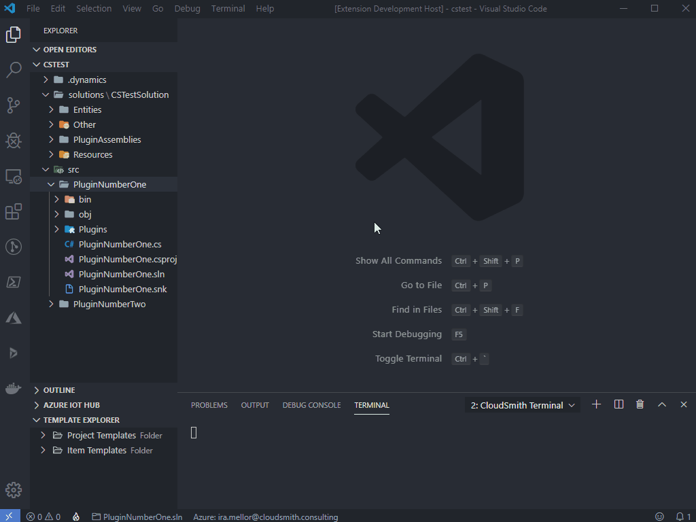
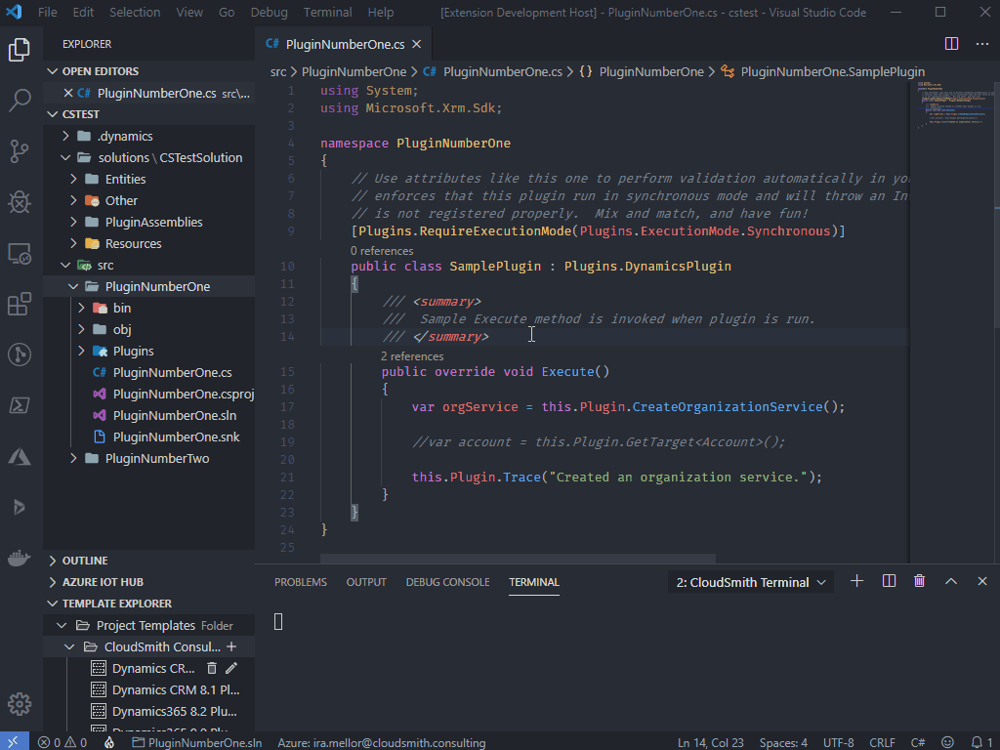
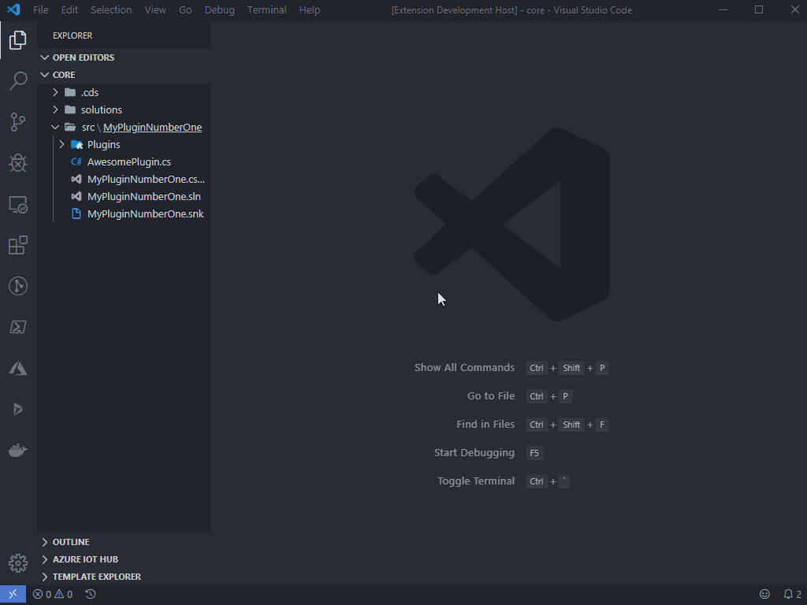
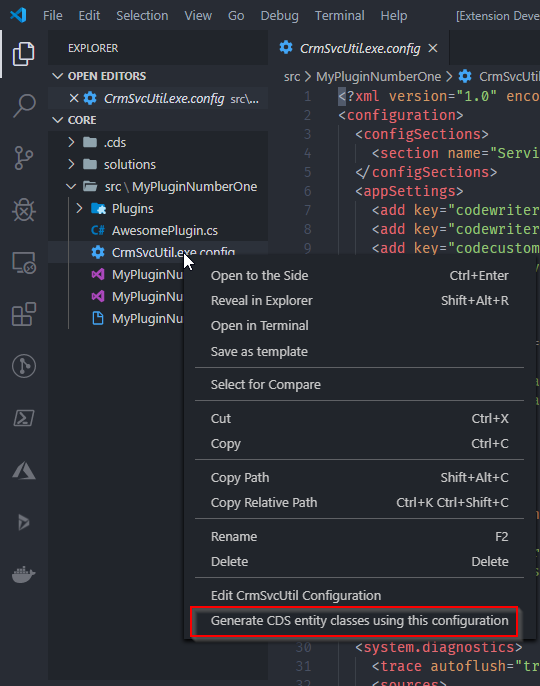

# How to: Use CrmSvcUtil to generate entities using CDS for Code

## Table of Contents

- [How to: Use CrmSvcUtil to generate entities using CDS for Code](#how-to-use-crmsvcutil-to-generate-entities-using-cds-for-code)
  - [Table of Contents](#table-of-contents)
  - [Overview](#overview)
  - [Standard Code Generation](#standard-code-generation)
    - [From the Command Palette](#from-the-command-palette)
    - [From File Explorer](#from-file-explorer)
  - [Customizing Code Generation](#customizing-code-generation)
    - [Generating CrmSvcUtil Configuration in File Explorer](#generating-crmsvcutil-configuration-in-file-explorer)
    - [Executing Code Generation With Custom Configuration in File Explorer](#executing-code-generation-with-custom-configuration-in-file-explorer)

## Overview

The CDS for Code extension will call out to the SvcUtil.exe application to generate strongly typed code for your project to use when communicating with CDS. You can read more about [creating early bound entity classes here](https://docs.microsoft.com/en-us/dynamics365/customerengagement/on-premises/developer/org-service/create-early-bound-entity-classes-code-generation-tool).

## Standard Code Generation

### From the Command Palette

To generate entities using the command palette:

1. Open the VSCode command palette (Ctrl + Shift + P)
2. Search for and select Generate entity code from metadata on a registered CDS environment
3. Select the target organization
4. Select the target folder
5. Type in the desired file name and press enter
6. Type in the desired Namespace and press enter

When put into action it will look similar to this:

### From File Explorer

To generate entites from VSCode File Explorer:

1. Right-click on the folder or exact file you want the entites to be generated to
2. Select your target organization
3. If you selected a folder it will prompt you for a file name
4. Type in the desired namespace and press enter

Generating code from File Explorer will look similar to this:

## Customizing Code Generation

CDS for Code allows for customizing the output of CrmSvcUtil.exe utelizing a CloudSmith utility library. This library allows for configuring the code generation process using a configuration file. CDS for Code will help you generate and customize this file. You can see [documentation on configuring this file manually here](../../tools/CrmSvcUtil.md).

### Generating CrmSvcUtil Configuration in File Explorer

A customizable CrmSvcUtil configuration file can be created by:

1. Right-click the directory you want the config file to be generated under
2. Click New CrmSvcUtli Configuration
3. Enter a file name for the output config file
4. Add rules using the Configure entity code generation screen
5. Click save

Here's an example of creating one in a templated plugin project:

### Executing Code Generation With Custom Configuration in File Explorer

Once you have a customized CrmSvcUtil configuration file, it can be used in place of the default configuration to generate early bound entities.

Inside of VSCode File Explorer:

1. Right-click your customized CrmSvcUtil configuration file
2. Click Generate CDS entity classes using this configuration
3. Select your connection
4. Select the location and file name for the generated code

Here's an example of what you will see when right-clicking the file:

This will kick off the code generation process.
