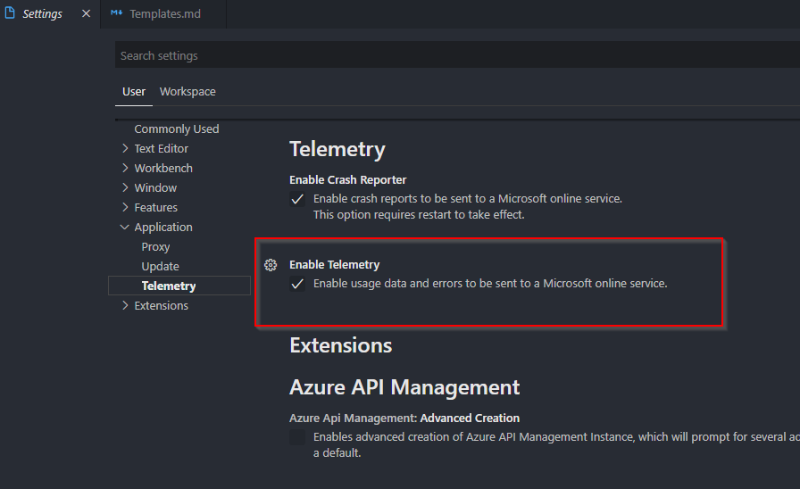

# Security Features in CDS for Code

## Table of Contents

- [Security Features in CDS for Code](#security-features-in-cds-for-code)
  - [Table of Contents](#table-of-contents)
  - [Encryption for passwords at rest and in transport](#encryption-for-passwords-at-rest-and-in-transport)
  - [Secure terminal](#secure-terminal)
  - [Hosted views and content security policies](#hosted-views-and-content-security-policies)
  - [Privacy features in CDS for Code](#privacy-features-in-cds-for-code)
    - [Sensitive logging](#sensitive-logging)
    - [Sensitive telemetry](#sensitive-telemetry)
    - [Opting out of telemetry](#opting-out-of-telemetry)

CloudSmith Consulting takes care to ensure that information collected by CDS for Code remains private and secure. These security and privacy precautions include, but are not limited to:

- Securing passwords and sensitive information at rest using advanced encryption
- Securing passwords and sensitive information in transport using advanced encryption
- Ensuring that passwords and sensitive information cannot be exposed to "screen scrapers" or other similar technologies
- Ensuring that cryptographic keys are stored and managed independently from encrypted data

## Encryption for passwords at rest and in transport

CDS for Code leverages 256-bit AES CBC encryption for all sensitive credential information.

- Encrypted information in our Secure Encryption Store is not decrypted until the moment it is absolutely necessary to make a call to the CDS feature that requires it. This would include things like retrieving connection refresh tokens, NTLM authentication, or any command line tools executed within the [CDS for Code Secure Terminal](#secure-terminal) that require a connection string or credentials
- Information encrypted and stored on the computer that CDS for Code is used on can not be decrypted on another computer. This means that if you are using the CDS for Code extension on multiple computers, the connections will have to be re-entered on each computer and will not be transferable to another computer
- There is no ability to decrypt information within the CDS for Code API. Any extension calling into the API methods will not have access to decrypted sensitive information such as user names or passwords

## Secure terminal

Some highlight features on our CDS for Code Secure terminal

- **User/Password masking** - Some operations agains CDS require a command line tool. These tools will often require a connection string or credentials. In these cases the CDS for Code extension will shell out to the terminal. The command will display but your username and password will be struck out.
- **Debug output masking** - When debug output is written, all sensitive data is either removed or masked within the output window

## Hosted views and content security policies

VSCode and it's webviews are built on top of NodeJS electron. Each webview in CDS for Code has a content security policy restricted to only get the assets from known locations to be used within CDS for Code extension. These assets can be from local or remote sources, but will only load based on the configured Content Security Policy for that webview.

More information is available about Content Security Policies

- [VSCode Webview Documentation on Content Security Policy](https://code.visualstudio.com/api/extension-guides/webview#content-security-policy)
- [Content Security Policies on the W3C website](https://www.w3.org/TR/CSP/)

## Privacy features in CDS for Code

We understand that PII and PHI are sensitive, for that reason we take care not to expose any of that information in our logging or telemetry collection.

You can read more about [CloudSmith Consulting's general privacy policy here](https://cloudsmithconsulting.com/About/Privacy).

### Sensitive logging

Logging is done to the file system or the CDS for Code output window in VSCode. We take care to sanitize these logs so that sharing them back to us in bug reports should not be an issue, as no sensitive information exists in them. Some of the logging precautions we take are:

- Credentials or sensitive encrypted information will be excluded from logs
- PII is excluded in logs, with these exceptions:
   1. Organization name
   2. Organization URL
  
### Sensitive telemetry

CDS for Code has telemetry that is passed back to our telemetry store to keep us informed of the extension's performance and reliablility. We take care to sanitize this telemetry so that your PII and encrypted information will never be sent to our telemetry store. Some of the telemetry precautions we take are:

- Credentials or sensitive encrypted information will be excluded from telemetry
- PII is excluded in telemetry, with these exceptions:
   1. Organization name
   2. Organization URL

### Opting out of telemetry

Our telemetry option is turned off by switching off the global telemetry preference within VSCode. To do this:

1. Open the file menu
2. Select Preferences
3. Select Settings
4. Click Application
5. Click Telemetry
6. Uncheck Enable usage data and errors to be sent to a Microsoft online service

It should look similar to this:

