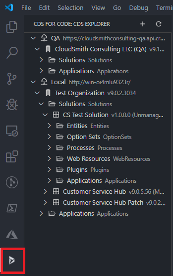
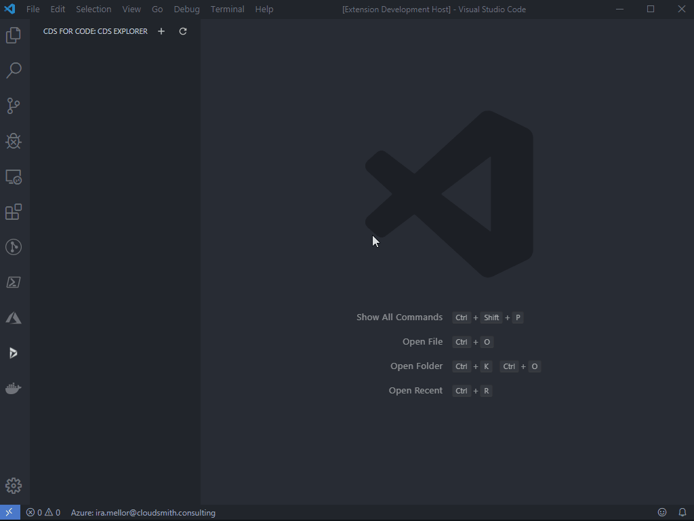
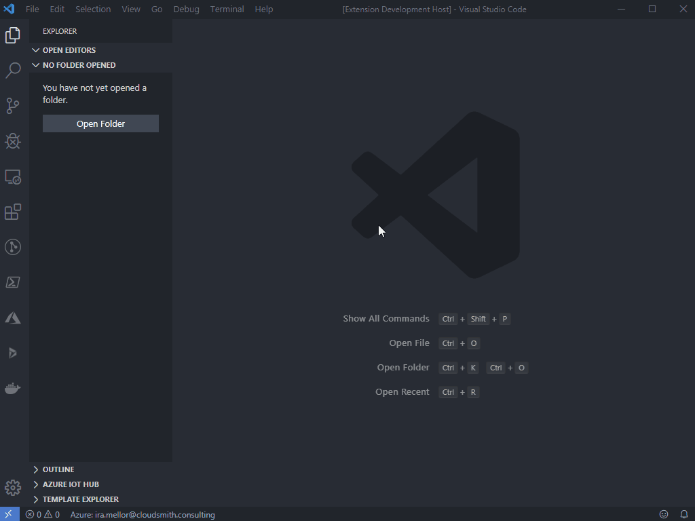
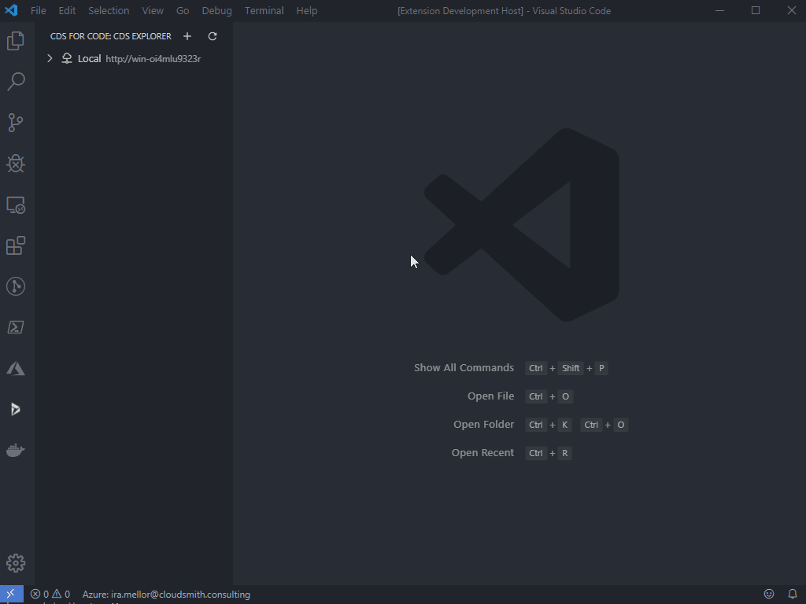

# How to: Manage CDS solutions using CloudSmith CDS for Code

## Table of Contents

- [How to: Manage CDS solutions using CloudSmith CDS for Code](#how-to-manage-cds-solutions-using-cloudsmith-cds-for-code)
  - [Table of Contents](#table-of-contents)
  - [CDS Explorer](#cds-explorer)
  - [Connecting to Common Data Service](#connecting-to-common-data-service)
    - [Connecting to Dynamics 365 On-Premises](#connecting-to-dynamics-365-on-premises)
    - [Connecting to CDS Online](#connecting-to-cds-online)
    - [Azure AD Connections](#azure-ad-connections)
    - [IFD / Claims (only supported through Azure Connections)](#ifd--claims-only-supported-through-azure-connections)
  - [Editing Connections](#editing-connections)
  - [Security](#security)
  - [Unpacking a solution from Common Data Service](#unpacking-a-solution-from-common-data-service)
    - [Unpacking using CDS Explorer](#unpacking-using-cds-explorer)
    - [Unpacking using File Explorer](#unpacking-using-file-explorer)
    - [Unpacking using the Command Palette](#unpacking-using-the-command-palette)
    - [Unpack Log Files](#unpack-log-files)
  - [Packing a solution and deploying to the Common Data Service](#packing-a-solution-and-deploying-to-the-common-data-service)
    - [Packing using File Explorer](#packing-using-file-explorer)
    - [Packing using the Command Palette](#packing-using-the-command-palette)
    - [Packing Log Files](#packing-log-files)
  - [Managing solution components](#managing-solution-components)
    - [Using your browser (edit button on solution)](#using-your-browser-edit-button-on-solution)
    - [Using the Command Palette](#using-the-command-palette)
    - [Using CDS Explorer](#using-cds-explorer)

## CDS Explorer

The CDS Explorer view in VSCode is where you can view connected servers, organizations and drill down to what's inside of them. You can find the CDS Explorer view by clicking the icon to the left added by the CDS for Code extension.

Here's an example of what the CDS Exporer will look like:



## Connecting to Common Data Service

The CDS for Code extension offers many ways to connect to different CDS instances. This would include On-Premises, Online servers and On-Premises servers behind an Azure AD with a registered client applicaton.

### Connecting to Dynamics 365 On-Premises

To connect to Dynamics 365 On-Premises through the CDS for Code extension:

1. Click the CDS for Code icon in the left gutter
1. Click the plus icon at the top of CDS Explorer
1. Choose a name for your connection
1. Select the WINDOWS (ON-PREMISES) tab
1. Enter your credentials including the Domain Name
1. Enter the URL to the Dynamics server instance
1. Click the Save button

Here is an example of what it will look like:



### Connecting to CDS Online

To connect to CDS Online through the CDS for Code extension:

1. Click the CDS for Code icon in the left gutter
1. Click the plus icon at the top of CDS Explorer
1. Choose a name for your connection
1. Select the CDS ONLINE tab
1. Enter your credentials
1. Click the Discover button
1. Click the Save button

Here is an example of what it will look like:



### Azure AD Connections

Connecting with Azure AD will registering an App Registration. You can read about [setting up Azure AD App registrations here](https://docs.microsoft.com/en-us/azure/active-directory-b2c/tutorial-register-applications?tabs=applications). This App Registration will also have to expose your API to authenticated applications. There's more information on [configuring App Registration API's here](https://docs.microsoft.com/en-us/azure/active-directory-b2c/tutorial-register-applications?tabs=applications).

To connect to CDS using your App Registration through the CDS for Code extension:

1. Click the CDS for Code icon in the left gutter
1. Click the plus icon at the top of CDS Explorer
1. Choose a name for your connection
1. Select the AZURE AD tab
1. Enter your configured redirect URL
1. Enter your configured authority URL
1. Enter the client ID of your App Registration
1. Enter the client secret generated in your App Registration
1. Click the Save button

### IFD / Claims (only supported through Azure Connections)

Coming soon!

## Editing Connections

Once you have [connected to CDS](#Connecting-to-Common-Data-Service), your connections will be listed in CDS explorer. At any time you can edit your connection by mousing over the desired connection to edit and clicking the pencil icon displayed. Once you are done editing your connection you can click the Save button to store the updated connection.

It will look similar to this:



## Security

CDS for Code has extensive security features for storing your credentials.

## Unpacking a solution from Common Data Service

> Note: When unpacking solutions using CDS for Code, it requires that you have a workspace open in VSCode. This can be done by selecting File > Open Folder
> You can select an existing folder or create a new folder and select it to be open.

### Unpacking using CDS Explorer

Unpacking a solution using CDS Explorer:

1. Click the CDS for Code icon in the left gutter
1. Expand the target connection
1. Expand the target organization
1. Expand the solutions folder
1. Right-click the target solution
1. Click export to workspace
1. Select the parent folder to unpack the solution into
1. Select whether or not to display the log after the operation

### Unpacking using File Explorer

Unpacking a solution using VSCode File Explorer:

1. Right-click the target parent directory
1. Select Download & unpack CDS solution here
1. Select whether or not to display the log after the operation

### Unpacking using the Command Palette

Unpacking a solution using the VSCode command palette:

1. Open the VSCode command palette (Ctrl + Shift + P)
1. Select Download & unpack solution from a registered CDS environment
1. Select the parent folder to unpack the solution into
1. Select whether or not to display the log after the operation

### Unpack Log Files

Once your solution is unpacked, should you choose to view the log file it will be automatically open for you in the VSCode editor.

It will look similar to this:

``` Log
2020-01-22 11:54:22.801 - Info	
Extracting C:\Users\ira\AppData\Local\Temp\CSTestSolution\CSTestSolution.zip to c:\dev\_blank\demo\solutions\CSTestSolution

2020-01-22 11:54:22.811 - Info	Resource template will be generated for default solution language.

LCID:1033 ISO Code:en-US.

 
2020-01-22 11:54:22.821 - Info	Localizing Assets...
2020-01-22 11:54:22.822 - Info	Localizing component: Templates
2020-01-22 11:54:22.822 - Info	Localizing component: EntityMaps
2020-01-22 11:54:22.822 - Info	Localizing component: Entities
2020-01-22 11:54:22.822 - Info	Localizing component: Workflows
2020-01-22 11:54:22.823 - Info	Localizing component: SolutionManifest
2020-01-22 11:54:22.822 - Info	Localizing component: Roles
2020-01-22 11:54:22.822 - Info	Localizing component: FieldSecurityProfiles
2020-01-22 11:54:22.824 - Info	Localizing component: EntityRelationships
2020-01-22 11:54:22.825 - Info	Localizing component: CustomControls
2020-01-22 11:54:22.825 - Info	Localizing component: SolutionPluginAssemblies
2020-01-22 11:54:22.825 - Info	Localizing component: EntityDataProviders
2020-01-22 11:54:22.825 - Info	Localizing component: optionsets
2020-01-22 11:54:22.831 - Info	Writing string resources...
2020-01-22 11:54:22.849 - Info	
2020-01-22 11:54:22.852 - Info	Processing Component: Entities
2020-01-22 11:54:22.852 - Info	 - Account
2020-01-22 11:54:22.855 - Info	Processing Component: Roles
2020-01-22 11:54:22.856 - Info	Processing Component: Workflows
2020-01-22 11:54:22.856 - Info	Processing Component: FieldSecurityProfiles
2020-01-22 11:54:22.856 - Info	Processing Component: Templates
2020-01-22 11:54:22.857 - Info	Processing Component: EntityMaps
2020-01-22 11:54:22.857 - Info	Processing Component: EntityRelationships
2020-01-22 11:54:22.859 - Info	Processing Component: optionsets
2020-01-22 11:54:22.859 - Info	Processing Component: CustomControls
2020-01-22 11:54:22.859 - Info	Processing Component: SolutionPluginAssemblies
2020-01-22 11:54:22.859 - Info	 - PluginNumberOne, Version=1.0.0.4, Culture=neutral, PublicKeyToken=f6e51c6c6ceee668
2020-01-22 11:54:22.861 - Info	 - PluginNumberTwo, Version=1.0.0.2, Culture=neutral, PublicKeyToken=f6e51c6c6ceee668
2020-01-22 11:54:22.862 - Info	Processing Component: EntityDataProviders
2020-01-22 11:54:22.863 - Info	
Unmanaged Extract complete.
```

## Packing a solution and deploying to the Common Data Service

> Note: When packing solutions using CDS for Code, it requires that you have a workspace open in VSCode. This operation also requires you have a solution unpacked to a folder within your workspace.

### Packing using File Explorer

Packing a solution using VSCode File Explorer:

1. Right-click the target solution directory
2. Select Deploy solution to CDS
3. Select whether or not to publish all customizations
4. Select whether or not to display the log after the operation

### Packing using the Command Palette

Packing a solution using the VSCode command palette:

1. Open the VSCode command palette (Ctrl + Shift + P)
2. Select Pack & deploy solution to a registerd CDS environment
3. Select the target solution directory
4. Select whether or not to publish all customizations
5. Select whether or not to display the log after the operation

### Packing Log Files

Once your solution is packed and deployed, should you choose to view the log file it will be automatically open for you in the VSCode editor.

It will look similar to this:

``` Log
2020-01-22 12:06:07.432 - Info	
Packing c:\dev\_blank\demo\solutions\CSTestSolution to C:\Users\ira\AppData\Local\Temp\CSTestSolution\CSTestSolution.zip

2020-01-22 12:06:07.439 - Info	Processing Component: Entities
2020-01-22 12:06:07.441 - Info	 - Account
2020-01-22 12:06:07.447 - Info	Processing Component: Roles
2020-01-22 12:06:07.448 - Info	Processing Component: Workflows
2020-01-22 12:06:07.449 - Info	Processing Component: FieldSecurityProfiles
2020-01-22 12:06:07.449 - Info	Processing Component: Templates
2020-01-22 12:06:07.449 - Info	Processing Component: EntityMaps
2020-01-22 12:06:07.449 - Info	Processing Component: EntityRelationships
2020-01-22 12:06:07.452 - Info	Processing Component: OrganizationSettings
2020-01-22 12:06:07.453 - Info	Processing Component: optionsets
2020-01-22 12:06:07.453 - Info	Processing Component: CustomControls
2020-01-22 12:06:07.455 - Info	Processing Component: SolutionPluginAssemblies
2020-01-22 12:06:07.459 - Info	 - PluginNumberOne, Version=1.0.0.4, Culture=neutral, PublicKeyToken=f6e51c6c6ceee668
2020-01-22 12:06:07.461 - Info	 - PluginNumberTwo, Version=1.0.0.2, Culture=neutral, PublicKeyToken=f6e51c6c6ceee668
2020-01-22 12:06:07.462 - Info	Processing Component: EntityDataProviders
2020-01-22 12:06:07.492 - Info	
Unmanaged Pack complete.
```

## Managing solution components

### Using your browser (edit button on solution)

Once you have a [registered connection to CDS](#connecting-to-common-data-service) you can manage the solution directly within CDS by:

1. Click the CDS for Code icon in the left gutter
2. Expand the target connection
3. Expand the target organization
4. Expand the solutions folder
5. Mouse over the target solution and click the pencil icon

You will be taken directly to manage the solution components in your browser.

### Using the Command Palette

Adding or removing solution components with the VSCode command palette:

1. Open the VSCode command palette (Ctrl + Shift + P)
2. Select Add/Remove solution component option
3. Select target solution
4. Select the type of component
5. Select the component to add/remove in your solution

### Using CDS Explorer

Adding and removing solution components in CDS Explorer:

1. Click the CDS for Code icon in the left gutter
2. Expand the target connection
3. Expand the target organization
4. Navigate to the component to add, or under a solution for a component to remove
5. Right-click the target component and select add/remove from solution
   1. If you are adding a component you will have to select the target solution
