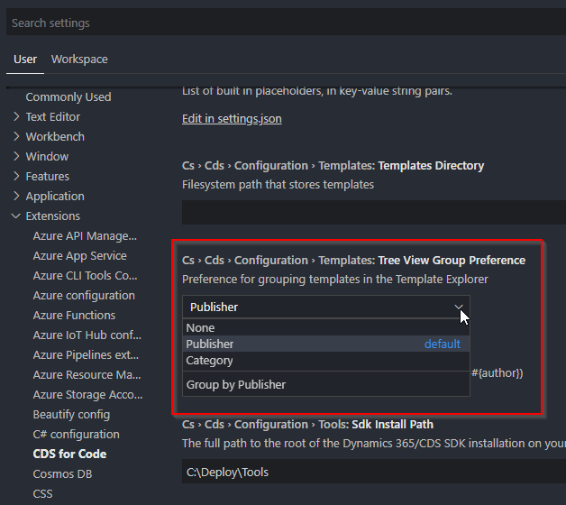

# How to: Use templates in CDS for Code

## Table of Contents

- [How to: Use templates in CDS for Code](#how-to-use-templates-in-cds-for-code)
  - [Table of Contents](#table-of-contents)
  - [Template Explorer](#template-explorer)
    - [Project Templates](#project-templates)
    - [Item Templates](#item-templates)
    - [Configurable grouping](#configurable-grouping)
  - [Creating a template](#creating-a-template)
    - [Creating a Project Template](#creating-a-project-template)
    - [Creating a File Template](#creating-a-file-template)
    - [Tokens and token format](#tokens-and-token-format)
    - [Interpolation](#interpolation)
  - [Exporting templates](#exporting-templates)
  - [Importing templates](#importing-templates)
  - [Create a project from a template](#create-a-project-from-a-template)
  - [What's not included](#whats-not-included)

## Template Explorer

Template Explorer can be found below the workspace in the VSCode File Explorer window. Template Explorer helps you manage templates with the ability to add, edit and delete them. Right-clicking a template in template explorer will allow you to go directly to the template directory for editing the template, create the templated project or item in your workspace, or export the template as a shareable zip file.

> Note: All templates will be asked for a publisher and category(ies) for grouping when displayed. [See more about grouping here](#configurable-grouping).

### Project Templates

Project templates are a collection of templated files in a directory structure. These project templates can be targeted at any language or project type. CDS For Code comes with built in project templates for creating CDS Plugins quickly, targeted at any version supported by CDS For Code.

### Item Templates

Item templates are individual file templates saved into CDS For Code templates. These can be single files of any type.

### Configurable grouping

Templates in CDS for Code can be grouped in the following ways:

1. By Publisher
2. By Category

When creating a template you will be asked for a publisher and template categories. The name/items selected will show the templates in Template Explorer based on what was chosen.

To change how templates are grouped in Template Explorer:

1. Open the command palette (Ctrl + Shift + P)
2. Select Preferences: Open User Settings
3. Navigate to Extensions > CDS for Code
4. Change the setting Cs › Cds › Configuration › Templates: Tree View Group Preference

It should look similar to this:

## Creating a template

### Creating a Project Template

Creating a project template can be performed the following ways:

1. Using VSCode File Explorer
2. Using the plus icon on Template Exporer
3. Using the VSCode Command Palette (Ctrl + Shift + P)

### Creating a File Template

Creating a file template can be performed the following ways:

1. Using VSCode File Explorer
2. Using the plus icon on Template Exporer
3. Using the VSCode Command Palette (Ctrl + Shift + P)

### Tokens and token format

Tokens are entered using #{MyTokenName}

### Interpolation

## Exporting templates

## Importing templates

## Create a project from a template

## What's not included

- Custom template binding
- Token base template logic
- Templates used as code generators
