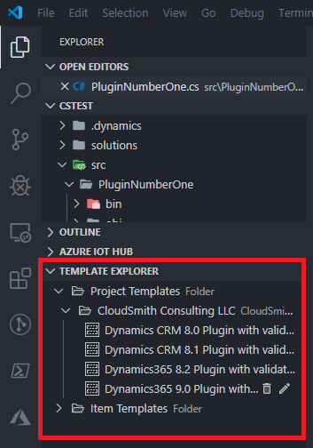

# How to: Use templates in CDS for Code

## Template Explorer

Template Explorer can be found below the workspace in the VSCode File Explorer window. Template Explorer helps you manage templates with the ability to add, edit and delete them. Right-clicking a template in template explorer will allow you to go directly to the template directory for editing the template, create the templated project or item in your workspace, or export the template as a shareable zip file.

### Project Templates

Project templates are a collection of templated files in a directory structure. These project templates can be targeted at any language or project type. CDS For Code comes with built in project templates for creating CDS Plugins quickly, targeted at any version supported by CDS For Code.

### Item Templates

Item templates are indif

### Configurable grouping

## Creating a template

### Tokens and token format

### Interpolation

## Exporting templates

## Importing templates

## Create a project from a template

## What's not included

- Custom template binding
- Templates used as code generators
