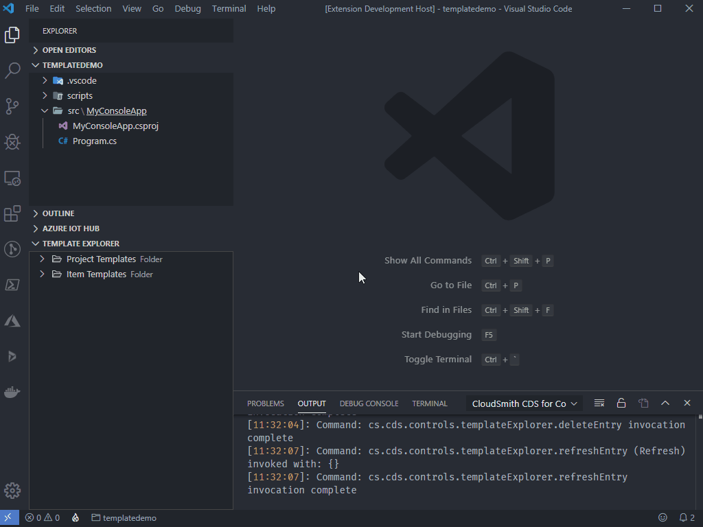
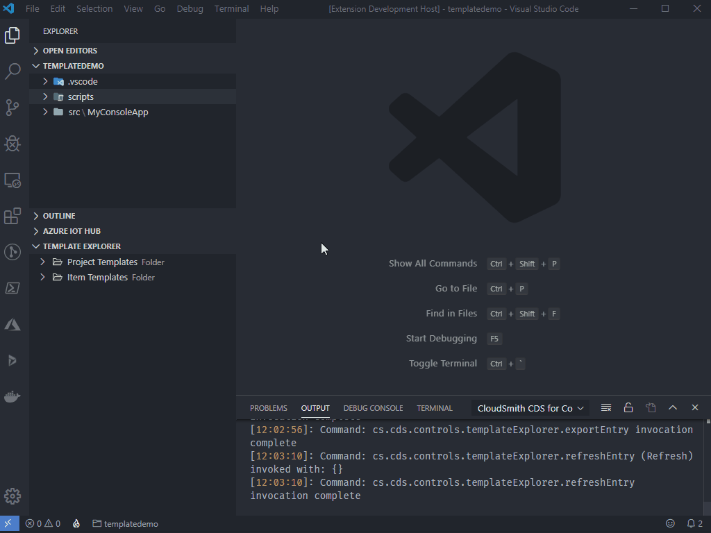

# How to: Use templates in CDS for Code

## Table of Contents

- [How to: Use templates in CDS for Code](#how-to-use-templates-in-cds-for-code)
  - [Table of Contents](#table-of-contents)
  - [Template Explorer](#template-explorer)
    - [Project Templates](#project-templates)
    - [Item Templates](#item-templates)
    - [Configurable grouping](#configurable-grouping)
  - [Creating a template](#creating-a-template)
    - [Creating a Project Template](#creating-a-project-template)
    - [Creating a File Template](#creating-a-file-template)
    - [Tokens and token format](#tokens-and-token-format)
    - [Interpolation](#interpolation)
  - [Exporting templates](#exporting-templates)
  - [Importing templates](#importing-templates)
  - [Create a project from a template](#create-a-project-from-a-template)
  - [What's not included](#whats-not-included)

## Template Explorer

Template Explorer can be found below the workspace in the VSCode File Explorer window. Template Explorer helps you manage templates with the ability to add, edit and delete them. Right-clicking a template in template explorer will allow you to go directly to the template directory for editing the template, create the templated project or item in your workspace, or export the template as a shareable zip file.

> Note: All templates will be asked for a publisher and category(ies) for grouping when displayed. [See more about grouping here](#configurable-grouping).

### Project Templates

Project templates are a collection of templated files in a directory structure. These project templates can be targeted at any language or project type. CDS For Code comes with built in project templates for creating CDS Plugins quickly, targeted at any version supported by CDS For Code.

### Item Templates

Item templates are individual file templates saved into CDS For Code templates. These can be single files of any type.

### Configurable grouping

Templates in CDS for Code can be grouped in the following ways:

1. By Publisher
2. By Category

When creating a template you will be asked for a publisher and template categories. The name/items selected will show the templates in Template Explorer based on what was chosen.

To change how templates are grouped in Template Explorer:

1. Open the command palette (Ctrl + Shift + P)
2. Select Preferences: Open User Settings
3. Navigate to Extensions > CDS for Code
4. Change the setting Cs › Cds › Configuration › Templates: Tree View Group Preference

It should look similar to this:

## Creating a template

### Creating a Project Template

Creating a project template can be performed the following ways:

1. Using VSCode File Explorer
2. Using the plus icon on Template Exporer
3. Using the VSCode Command Palette (Ctrl + Shift + P)

> Note: For .NET projects it is recommended to delete the bin and obj folders before creating a project template out of it.

Below is an example of creating a project template using VSCode File Explorer:

### Creating a File Template

Creating a file template can be performed the following ways:

1. Using VSCode File Explorer
2. Using the plus icon on Template Exporer
3. Using the VSCode Command Palette (Ctrl + Shift + P)

Below is an example of creating a file template using VSCode File Explorer:

### Tokens and token format

CDS for Code templating supports tokens for inputs to be run during interopolation of creating a project or file from a template. The default regular expression used is `#{([\s\S]+?)}` but this can be change in the settings.

By default templates can use `#{variableName}` in the following manners:

- As token to be written within a file
- As a file name or directory name

These can be put anywhere in the template and the processor will find them prompting the user for inputs for them.

Your template can also include a template.json file which will help define more things such as naming of the output directory, placeholder tokens description with optional required, and directives that will tell the processor to skip tokens on certain files. Having a **template.json file is not required** for the processor to replace tokens, although helps the processor by defining required fields and directives for skipping interopolation on certain files.

You can see an example of one of [our templated projects here](https://github.com/cloudsmithconsulting/cds-for-code/tree/master/resources/templates/UserTemplates/CloudSmith.Cds.SamplePlugin.v9.0). Be sure to also check out the [associated template.json file found here](https://github.com/cloudsmithconsulting/cds-for-code/blob/master/resources/templates/UserTemplates/CloudSmith.Cds.SamplePlugin.v9.0/template.json).

### Interpolation

Template interopolation will occur when the template is being used to create a new project or item. The template processor will read from any placeholders, prompting the user to give values for them.

Once the user has filled in all required values the processor will execute the token replacement during template creation in your workspace.

## Exporting templates

Right-clicking any template in Template Explorer will provide the ability to export a template for sharing with friends or co-workers.

Here is an example of exporting a template:

## Importing templates

## Create a project from a template

## What's not included

- Custom template binding
- Token base template logic
- Templates used as code generators
