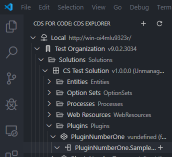
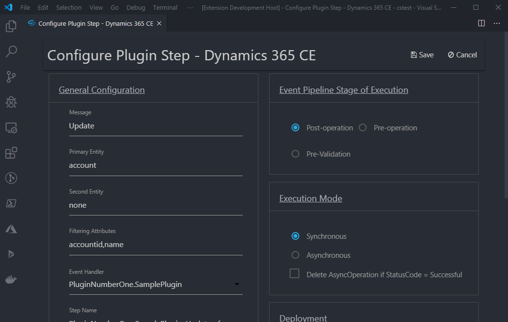
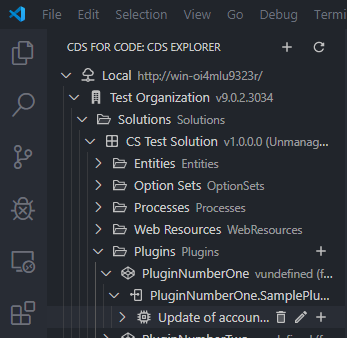
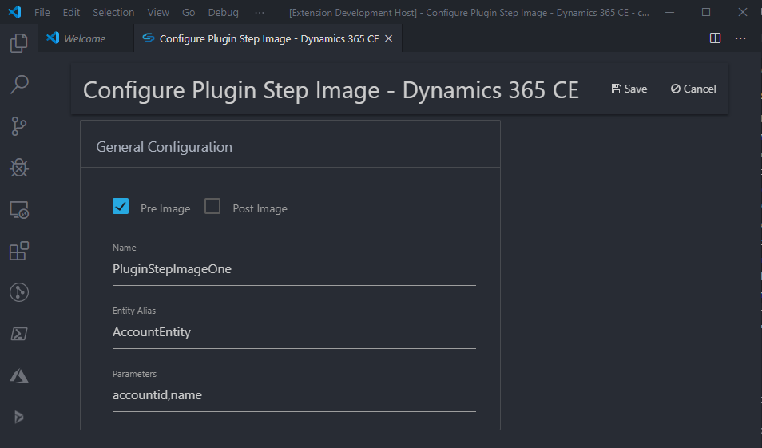

# How to: Develop plugins with CDS for Code

## Table of Contents

- [Prerequisites](#Prerequisites)
- [Developing Plugins](#Developing-plugins)
- [Registering Plugins](#Registering-plugins)
- [Managing Plugin Steps](#Managing-plugin-steps)
- [Plugin Step Images](#Plugin-step-images)

## Prerequisites

- [C# for Visual Studio Code](https://marketplace.visualstudio.com/items?itemName=ms-vscode.csharp)
- [.Net Core 3.0](https://dotnet.microsoft.com/download/dotnet-core/3.0)
- [CRM SDK](https://docs.microsoft.com/en-us/dynamics365/customerengagement/on-premises/developer/download-tools-nuget) (automatically downloaded for you by the CDS for Code extension)

## Developing plugins

### Create a new plugin from scratch using Visual Studio

There is documentation [here about creating and registering plugins in Visual Studio](https://docs.microsoft.com/en-us/powerapps/developer/common-data-service/tutorial-write-plug-in) for use in CDS.

Coming soon: instructions using the .NET Core CLI

### Create a new plugin from a template

#### Within VSCode File Explorer

1. Right-click the directory you want the project parent folder created within
1. Click New Templated Project
1. Enter the project namespace and assembly name then press enter
1. Enter the class name for the project then press enter

#### Within CDS for Code Template Explorer

1. Expand Project Templates
1. Expand CloudSmith Consulting LLC
1. Right-click the target template to use
1. Click Create in workspace
1. Select the directory you want the project parent folder created within, or create a new one
1. Enter the project namespace and assembly name then press enter
1. Enter the class name for the project then press enter

You'll find the CDS for Code Template Explorer in the VSCode Explorer view. It will look similar to this:

> Note: Once your project is created you may see a VSCode notification saying that the project needs packages to be restored. Saying yes will restore the packages used by the plugin project.

### Use an existing plugin project from Visual Studio

Coming soon

## Registering plugins

### Deploy from File Explorer

Plugins can be deployed through the context menu of *.csproj project files in VSCode File Explorer.

1. Right-click the target *.csproj file
1. Click Build project
1. Select if you want to see the logs from the build
1. Right-click the target *.csproj file again
1. Click Deploy assembly to CDS
1. Select which DLL file you want to deploy (we recommend from the /bin folder)
1. Select the solution you want the plugin assembly to be deployed within
1. You may be prompted to select which assembly you want to overwrite
    1. If this is a new assebly simply press the esc key
    1. If you want to overwrite an assembly, select the assebly to overwrite then press enter

After the assembly is deployed to the server, the Configure Plugin Step dialog will be displayed. More about this can be found in the [Plugin step UI section](#Plugin-step-UI)

### Update/deploy from CDS Explorer

Coming soon

## Managing plugin steps

### Create plugin steps from CDS Explorer

Plugin steps can be created in CDS Explorer by:

1. Open the CDS Explorer view by clicking the CDS for Code icon
1. Expand the top level connection
1. Expand the Organization
1. Expand the Solutions folder
1. Expand the target solution
1. Expand the plugins folder
1. Expand the target plugin assembly
1. Mouse over the target plugin assembly namespace and click the plus icon

Your CDS Explorer view will look similar to this:

### Plugin step UI

Creating or editing a plugin step will be done on the following screen:

> Note: Fields like message, primary entity and second entity will have auto complete

### Modify or remove plugin steps

Plugin steps can be edited or deleted in CDS Explorer by:

1. Open the CDS Explorer view by clicking the CDS for Code icon
1. Expand the top level connection
1. Expand the Organization
1. Expand the Solutions folder
1. Expand the target solution
1. Expand the plugins folder
1. Expand the target plugin assembly
1. Expand the plugin namespace
1. Mouse over the target plugin step and click the trash or pencil icon

The view for CDS Explorer will look similar to this:

## Plugin step images

### Create plugin step images from CDS Explorer

Plugin steps images can be edited or deleted in CDS Explorer by:

1. Open the CDS Explorer view by clicking the CDS for Code icon
1. Expand the top level connection
1. Expand the Organization
1. Expand the Solutions folder
1. Expand the target solution
1. Expand the plugins folder
1. Expand the target plugin assembly
1. Expand the plugin namespace
1. Mouse over the target plugin step and click plus icon

The view for CDS Explorer will look similar to this:

### Modify or remove plugin step images

Plugin steps images can be edited or deleted in CDS Explorer by:

1. Open the CDS Explorer view by clicking the CDS for Code icon
1. Expand the top level connection
1. Expand the Organization
1. Expand the Solutions folder
1. Expand the target solution
1. Expand the plugins folder
1. Expand the target plugin assembly
1. Expand the plugin namespace
1. Mouse over the target plugin step and click trash or pencil icon

## What's not included

- Managing plugin steps locally (persist to filesystem)
- Unpack plugin steps with solution update
