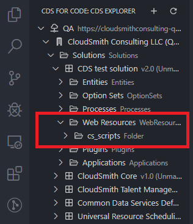
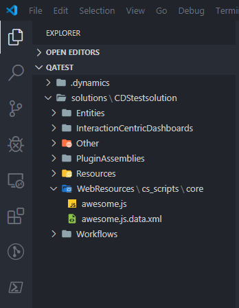
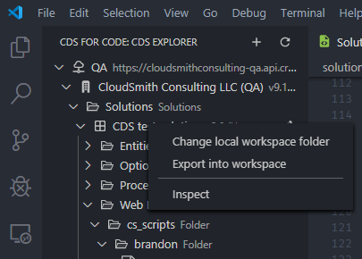

# How to: Create, Edit, Rename and Delete Web Resources

Web resources are an essential part of customizing CDS. You can read more about this [topic in the CDS documentation here](https://docs.microsoft.com/en-us/powerapps/maker/model-driven-apps/create-edit-web-resources).

## Table of Contents

- [View Web Resources](#View-Web-Resources)
- [Create a Web Resource](#Create-a-Web-Resource)
- [Edit a Web Resource](#Edit-a-Web-Resource)
- [Pack and Unpack](#Pack-and-Unpack)
- [Inspect](#Inspect)
- [Unsupported Scenarios](#Unsupported-Scenarios)

## View Web Resources

### CDS Explorer and Folder View

Viewing web resources in a CDS solution can be done within the CDS Explorer view of CDS for Code.

To view web resources in a connected CDS instance:

1. Open the CDS Explorer view by clicking the CDS for Code icon
1. Expand the top level connection
1. Expand the Organization
1. Expand the Solutions folder
1. Expand the target solution
1. Expand the Web Resources folder

This view will show all web resources within the solution and the naming/folder structure it contains as shown in the image below.

## Create a Web Resource

### Create From CDS Explorer

Creating a web resource from CDS Explorer will open a browser window directly to the page for creating a new web resource.

> Note: When web resources are created this way, they will not exist in your local workspace until the solution is exported.

To create a new web resource from CDS Explorer:

1. Open the CDS Explorer view by clicking the CDS for Code icon
1. Expand the top level connection
1. Expand the Organization
1. Expand the Solutions folder
1. Expand the target solution
1. Mouse over the Web Resources folder and click the plus icon

You will be directed to the page for [creating a web resource directly in your CDS solution](https://docs.microsoft.com/en-us/powerapps/maker/model-driven-apps/create-edit-web-resources#create-or-edit-web-resources).

### Create From File Explorer

Once a solution has been exported into a local workspace, creating a web resource can be done directly through the VSCode File Explorer.

To create a new web resource in the File Explorer view in your CDS workspace:

1. Right-click the solution folder or the web resources folder in your local workspace
1. Click New Web Resource
1. Enter the full path and name for your new web resource and press enter
1. Enter a display name for your new web resource and press enter
1. Enter a description for your new web resource and press enter
1. Select whether or not this web resource is for mobile use
1. Select whether or not this web resource is for offline use

> Note: When naming a web resource the full path will be required. The CDS for Code extension will break the names up into folders in your local workspace.
>
> For example: {publisher_prefix}_scripts/folder/subfolder/script.js
>
> The publisher prefix must match the solution publisher prefix for CDS.

After completing the new web resource wizard, you will have the ability to edit this web resource locally inside your workspace.

## Edit a Web Resource

### Edit From CDS Explorer

Editing a web resource from CDS Explorer will open a browser window directly to the page for editing a web resource.

> Note: When web resources are edited this way, the changes will not exist in your local workspace until the solution is exported.

To edit a new web resource from CDS Explorer:

1. Open the CDS Explorer view by clicking the CDS for Code icon
1. Expand the top level connection
1. Expand the Organization
1. Expand the Solutions folder
1. Expand the target solution
1. Expand the Web Resources folder
1. Expand any folder under which the web resource exists
1. Mouse over the name of the web resource and click the pencil icon

You will be directed to the page for editing the web resource directly in you CDS solution.

### Edit From File Explorer

Once a solution has been exported into a local workspace, editing a web resource can be done directly through the VSCode File Explorer.

To edit a web resource in the File Explorer view in your CDS workspace:

1. Expand the local workspace solution folder
1. Expand the WebResources folder
1. Expand any folder(s) under which the web resource file will exist
1. Open the file and begin editing

## Pack and Unpack

### Unpacking Web Resources

Unpacking web resources is done throught the solution export feature.

To export a solution to a new or existing local workspace:

1. Open the CDS Explorer view by clicking the CDS for Code icon
1. Expand the top level connection
1. Expand the Organization
1. Expand the Solutions folder
1. Right-click the solution to export
1. Click Export into workspace
1. Select whether or not you want to view the log for the operation

The context menu for exporting your solution will look like the image below

### Packing Web Resources

Packing and publishing web resources can be done from directly within the VSCode File Explorer.

To pack and publish your web resource:

1. Expand the local workspace solution folder
1. Expand the WebResources folder
1. Expand any folder(s) under which the web resource file will exist
1. Right-click the web resource file
1. Click Deploy web resource to CDS
1. Select your target organization
1. Select your target solution

## Add to Solution / Remove from Solution for Existing Web Resources

Adding and removing web resources within solutions can be done directly within CDS Explorer.

### Add Existing Web Resource to Solution

To add a web resource to a solution in CDS Explorer:

1. Open the CDS Explorer view by clicking the CDS for Code icon
1. Expand the top level connection
1. Expand the Organization
1. Expand the Web Resources folder
1. Expand any other folder(s) under which the web resource file will exist
1. Right-Click the web resource file
1. Click Add to solution
1. Select the target solution

### Remove Existing Web Resource from Solution

To remove a web resource from a solution in CDS Explorer:

1. Open the CDS Explorer view by clicking the CDS for Code icon
1. Expand the top level connection
1. Expand the Organization
1. Expand the Solutions folder
1. Expand the target solution
1. Expand the Web Resources folder
1. Expand any other folder(s) under which the web resource file will exist
1. Right-Click the web resource file
1. Click Remove from solution

## Inspect

You can inspect the JSON returned for any web resource in CDS for Code.

To inspect the JSON for a web resource:

1. Open the CDS Explorer view by clicking the CDS for Code icon
1. Expand the top level connection
1. Expand the Organization
1. Expand the Solutions folder
1. Expand the target solution
1. Expand the Web Resources folder
1. Expand any other folder(s) under which the web resource file will exist
1. Right-Click the web resource file
1. Click Inspect

## Unsupported Scenarios

- Renaming web resources in File Explorer
- Deleting web resources in File Explorer and having those changes reflected in the CDS solution on the server [#341](https://dev.azure.com/cloudsmith-consulting/CloudSmith/_workitems/edit/341)
